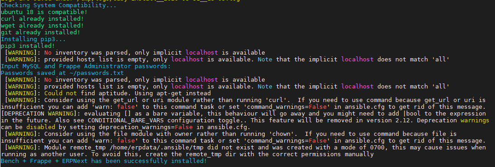

# Install ERPNext on Ubuntu 18.04
How to install ERPNext on Ubuntu 18.04 in DigitalOcean, Amazon AWS or any other droplet provider. Before we start installing you have to know about what is ERPNext?

> ERPNext is a free and open-source integrated web-based ERP software developed by Frappe. ERPNext is used by manufacturers, distributors and services companies. In ERPNext offer large number of Apps like accounting, sales, CRM, purchasing, e-commerce, point of sale, inventory, manufacturing, warehouse, project management and many more. So let’s start how to install ERPNext on Ubuntu 18.04.


## Installation & Usage

## (1St Step) Login to ssh console (root)

run below script. it'll ask a username just add "erpnextuser"

###### Use only on Ubuntu-18.04.

```sh
wget -qO erpnext run.kloudboy.com/erpnext && sudo bash erpnext
```

> In DigitalOcean 1GB Droplet installation time take 15 to 20 minutes, and some Yellow warnings never mind. just leave it.



## Final Bench + Frappe + ERPNext has been successfully installed!


## Update the Bench by running commands below:

login to user account

> su - username

> cd username/

> bench update

## Try DigitalOcean for Free with a $100 Credit


Offer Link:- https://offer.kloudboy.com/100USD-credit-coupon

## Author

Bajpan Gosh – [@bajpangosh](https://twitter.com/bajpangosh) – bajpan@kloudboy.com


## NEED HELP?

We are a team of dedicated Cloud Server Administrators assures 24/7 availability of experts for all levels of your server management requirements.

I'd be glad to help you if you have any questions relating to this script. No guarantees, but I'll do my best to assist.

Support via Facebook, Twitter, Email, Ticket

email    :-support@kloudboy.com

facebook :- https://m.me/TeamKloudBoy

twitter  :- https://twitter.com/TeamKloudBoy

ticket   :-https://kloudboy.freshdesk.com/support/home

Made By 💘 https://kloudboy.com
